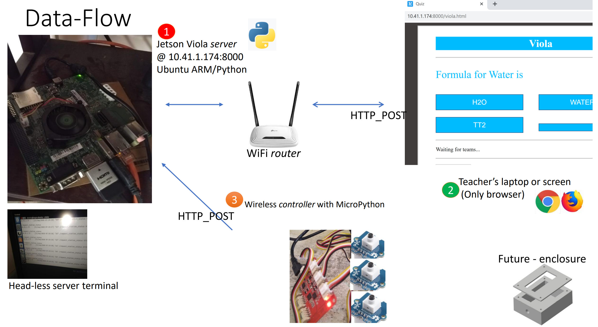

# viola
Open Multimedia Framework for Assisted Learning

With just a local network setup, a complete curriculum can be taught and questions gathered, with an ARM based server and a browser client, and wiolink/compatible ESP board.

- Server can run on any HW (x86/x64/ARM) supporting python
- Client keyboard code is to be run on any micropython compatible HW - currently tried on Wiolink

## Dataflow

